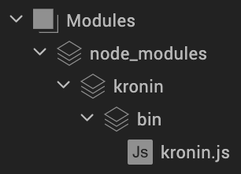

# Krōnin

A collection of [Rōnin](https://en.wikipedia.org/wiki/R%C5%8Dnin) extensions to enhance the Kony SDK.

### Install

[Krōnin is published to the NPM Registry](https://www.npmjs.com/package/kronin) so you can just install it into your project using the NPM command line by stepping into the project's root directory and running:

```bash
npm install kronin --prefix modules
```

This will install Krōnin into `[project_root]/modules/node_modules/kronin`. Then in Visualizer click *Project/Refresh*. Visualizer will pick up the `node_modules` and `kronin` directories as [*application groups*](https://docs.kony.com/konylibrary/visualizer/visualizer_user_guide/Content/OrganizingAppElementsInGroups.htm).

.

## PubSub

An adaptation of [AmplifyJS's PubSub Core](http://amplifyjs.com/api/pubsub/), this namespace allows you to leverage the PubSub
pattern in your applications. Like AmplifyJS, this supports these three functions:

* publish
* subscribe
* unsubscribe

Additionally, this adaptation offers these three additional methods:

### allowDuplicates(boolean)

Set whether or not to allow the same function to subscribe more than once to a
topic. By default this is set to `false`.

### getSubscriptions(string)

Returns an array of all the functions subscribed to a topic.

```javascript
function onFoo(){}
function onFoo2(){}
kony.amplify.subscribe("foo", onFoo);
kony.amplify.subscribe("foo", onFoo2);
kony.amplify.getSubscriptions("foo");
//[onFoo, onFoo2]
```

### isSubscribed(string, function)

Returns whether a specific function is subscribed to a topic.

```javascript
function onFoo(){}
kony.amplify.subscribe("foo", onFoo);
kony.amplify.isSubscribed("foo", onFoo);
//true
```

## Animations

Shorthand functions for common animation use cases. These help reduce the amount of
code needed to create an animation because they make assumptions on some animation
settings which meet most commonplace uses. For example, most animations are done
over a single property, from step `0` to step `100`, with `iterationCount: 1` and
`fillMode: kony.anim.FILL_MODE_FORWARDS`. These shorthand functions make all
of these assumptions for you, and allow you to only specify the bare minimum you
need.

### animate

Creates an animation on an arbitrary property of a widget from an initial value
to a final value, while allowing you to specify delay and duration, and using
common default settings such as `delay: 0` and an `EASE_IN_OUT` timing.

```javascript
kony.animations.animate(widget, animationProperty, initialValue, finalValue, duration, delay, timing);
kony.animations.animate("widget1", "opacity", 0, 1);
kony.animations.animate("widget2", "top", "100%", "0%",
	1.5, //duration
	0.25, //delay
	kony.anim.EASE_IN //timing
);
```

### reveal

Reveals a widget by animating its `opacity` from `0` to `1` —assuming of course
that it has previously been set to `0`. It's particularly useful if you've set
the widget's `opacity` to `0` during `preShow` and then want to make it
progressively visible after the screen is shown on `postShow`.

```javascript
kony.animations.reveal(widget, duration, delay, timing);
kony.animations.reveal("widget1",
	1.2, //duration
	0.25, //delay
	kony.anim.LINEAR //timing
);
```

### rotate

Creates a linear rotation animation without having to create multi-step
animation. This function will dynamically generate all the animation
steps needed to do the rotation and proportionally (as best as possible)
assign each a part of the duration you specify in order to make it as
smooth as possible.

**Note:** At the moment this still has issues with funny angles.

```javascript
TODO: Example
```

## Application

### setAppBarColor(string)

Sets the color of the Android application bar at the top on the screen.

```javascript
kony.application.setAppBarColor("cc0000");
```

## kony.os

* getOs()
* isAndroid()
* isIos()
* isWeb()

## Internationalization

### getLocalizedString2(string, object)

Get the localised string for an i18n key or return the key itself if none exists
for the current locale. This is useful because if there are gaps in a language
bundle, seeing the actual key on screen helps identify the missing translations
— as opposed to just seeing a blank and wondering what the key is.

This function also supports substitution variables specified with curly brackets
— e.g.: If the localised string of an i18n key `message.greeting` is
`Hello {name}, count to {count}!`, then:

```javascript
kony.i18n.getLocalizedString2("message.greeting", {
	"name": "Miguel",
	"count": 3
});
//Hello Miguel, count to 3!
```

### i18n.localizeWidget

Shorthand function to localize the text on a widget using
`kony.i18n.getCurrentLocale2`.

```javascript
kony.i18n.localizeWidget(widget);
//equivalent to widget.text = kony.i18n.getLocalizedString2(widget.text);
```

### i18n.getCurrentLocale2

Returns a string representing the current locale, the same as
`kony.i18n.getCurrentLocale` but using a hyphen (`-`) character to separate
country and language ISO codes —as the BCP 47 does— rather than an underscore
(`_`) character —as the `kony.i18n` API does.

```javascript
kony.i18n.getCurrentLocale();
//es_SP, en_GB, etc
kony.i18n.getCurrentLocale2();
//es-SP, en-GB, etc
```

### i18n.getDecimalSeparator

Returns the decimal separator according to the current locale.

```javascript
kony.i18n.getDecimalSeparator()
// ',' if current locale is 'es_SP'

kony.i18n.getDecimalSeparator()
// '.' if current locale is 'en_GB'
```

### i18n.getThousandsSeparator

Returns the thousands separator according to the current locale.

```javascript
kony.i18n.getThousandsSeparator()
// '.' if current locale is 'es_SP'

kony.i18n.getThousandsSeparator()
// ',' if current locale is 'en_GB'
```

### i18n.getFormattedAmount

Formats a number into an amount or percentage while using the decimal separator
and digit grouping (thousands separator or equivalent) appropriate for the
current locale.

```javascript
kony.i18n.getFormattedAmount(number, decimalPlaces, asPercentage);
kony.i18n.getFormattedAmount(1001.25, 2, true);
//'1,001.25%' if current locale is 'en_GB'
kony.i18n.getFormattedAmount(1001.25, 1);
//'1.001,2' if current locale is 'es_SP'
```

### i18n.getCurrencyAmount

Formats a currency amount by using whatever decimal separator and digit grouping
(thousands separator or equivalent) are appropriate for the current locale.

```javascript
kony.i18n.getCurrencyAmount(number, decimalPlaces, currency, currencyDisplay);
kony.i18n.getCurrencyAmount(1234.5, 2,
	"EUR",
	"symbol"
);
//'1.234,50 €', assuming a locale of 'es_SP'.

kony.i18n.getCurrencyAmount(1234.5, 2,
	"EUR",
	"code"
);
//'1.234,50 EUR', assuming a locale of 'es_SP'.

kony.i18n.getCurrencyAmount(1234.5, 2,
	"GBP"
);
//'£1,234.50', assuming a locale of 'en_GB'
```

## kony.mvc

### genAccessors(controller, Array)

Define a component's setters and getters for any custom fields in one line by
just listing the fields.

```javascript
define(function() {
	return{
		constructor: function() {...},
		initGettersSetters: function() {
			kony.mvc.genAccessors(this, ["foo","bar"]);
			//Defines accessors getFoo, setFoo, getBar and setBar
		}
	}
})
```

### wire(controller)

Binds any `init`, `preShow`, `postShow` or `onHide` functions defined in the
current controller to the corresponding view's life cycle events, without having
to use actions or additional code to do it.

These functions are also bound with a wrapping `try/catch` statement, so that if
there are syntax errors in the functions defined, they'll be easier to debug
-e.g. This could be the body of a forms's controller.:

```javascript
define(function(){

	return{
		init: function(){...},
		preShow: function(){...},
		postShow: function(){...},
		onHide: function(){...},
		onNavigate: function(){
			kony.mvc.patch(this);
			//Now init, preShow, postShow, onHide are all bound.
		}
	};
});
```

## router

A convenient way to do all the navigations from a centralized place, which also
provides a history of the navigations, allowing you to go back in a logical way.
When used along with `kony.mvc.patch` this router also allows you to query which
the current form is — something that's not readily possible in MVC projects.

* init(maxHistorySize)
* goTo(formIdOrFriendlyName, context, isGoingBack)
* getCurrent()
* goBack(context)
* goHome(context)
* getHistory()

## Timers

## schedule2

Safely schedules a timer. It behaves just like `kony.timer.schedule` but,
instead of expecting a unique timerId, it just generates one for you and returns
it, thus avoiding the need for you to come up with a unique ID every time.

```javascript
var timerId = kony.timer.schedule2(fn, delay, repeat);
var timerId = kony.timer.schedule2((name) => {
	alert(`Hello ${name}`);
}, 0.2, true);
```

## cancel2

Safely cancels a timer. It behaves just like `kony.timer.cancel`, but without
assuming the timer is scheduled. It does _not_ throw errors if the timer does
not exist or has been cancelled already. This is useful if the timer you mean to
cancel may be cancelled from several places in your logic, and you wish to avoid
possible errors due to race conditions.

```javascript
kony.timer.cancel2(timerId);
//Does not need a try/catch just in case timerId does not exist or is already cancelled.
```

## UI

### getDescendants(containerWidget, includeParent, function)

Returns an array containing all the widgets nested within a form or container
widget. The container widget may be a Form, a Flex Container, Scroll Flex
Container or any other widget capable of containing other widgets.

It also allows you to specify a function to filter which children should be
included in the result. The filtering function must be one returning a `boolean`.

```javascript
kony.ui.getDescendants(this.view.flxTop, true, (child) => {
	return child.id.substring(0,3) === "flx";
});
//[flxTop, ...] including any child of flxTop named with an "flx" prefix.
```

### getComponents(containerWidget, includeParent)

A convenience function equivalent to using `getDescendants` with a filter to
select component instances only.

## Disclaimer

Krōnin is meant as a community project. It is **Not** part of the Kony Platform
and it's not supported by Kony Inc. in any way — Hence the *Rōnin* bit ;)

## Contribute

To figure out how to build Krōnin for development check out [CONTRIBUTE.md](./CONTRIBUTE.md).
